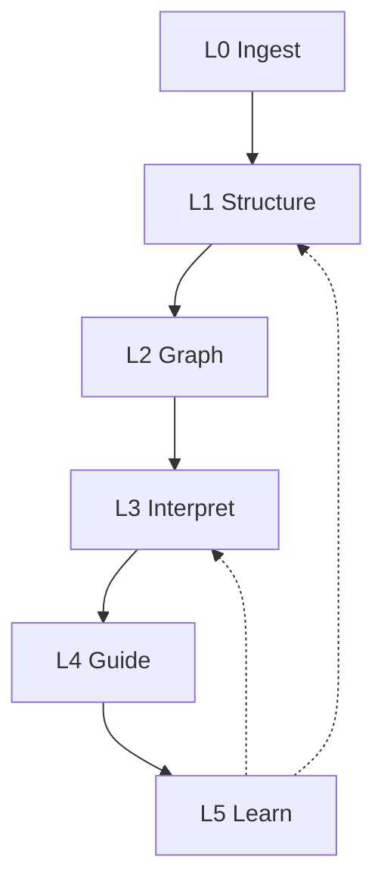
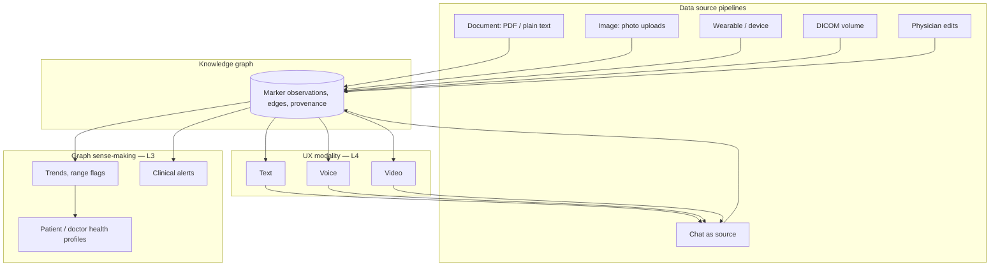
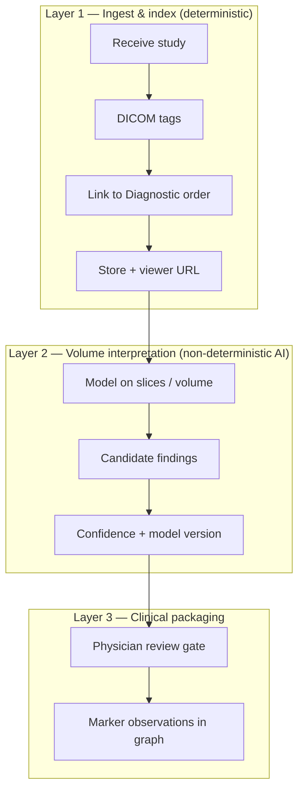
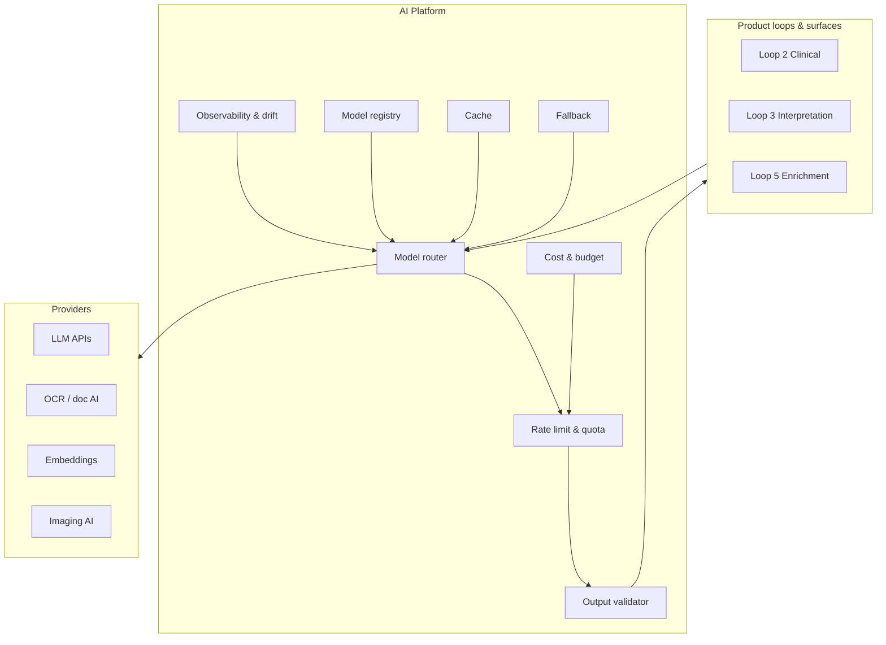

**Version:** 2.0 · **Date:** July 2026  
**Related:** [Product Blueprint](/clients/zen/doc-2/) §8 · [Entity Model](/clients/zen/doc-1/)

Single document for AI at Zenlife: **strategy → roadmap → platform**.

---

# Part I — AI Strategy

*How to think about AI before what to build when.*

---

## 1. Strategic overview

Zenlife AI turns heterogeneous inputs (lab PDFs, uploads, chat, imaging, wearables) into a **living knowledge graph**, then projects that graph into **patient-facing and doctor-facing health profiles**, **guidance** (text / voice / video), and **learning** from physician corrections and outcomes.

Six dimensions govern every AI decision:

| # | Dimension | Question it answers |
|---|-----------|---------------------|
| 1 | **Capability layers (L0–L5)** | What class of AI work is this? |
| 2 | **Data sources** | What raw material enters, through which pipeline? |
| 3 | **UX modality** | How does the user interact — text, voice, video? |
| 4 | **Graph evolution** | How do facts merge, age, and version over time? |
| 5 | **Human-in-the-loop (HITL)** | How much autonomy does AI have vs physician? |
| 6 | **Eval & safety** | What must pass before we ship or promote a model? |

**Two axes — do not conflate:**

| Axis | Scope |
|------|--------|
| **Data sources** | Ingest → interpret → extract → graph *(backend pipelines)* |
| **UX modality** | Text / voice / video *(interaction layer on the same graph)* |

**Chat is both:** text UX modality (Loop 3) and a data source when messages yield extractable facts.

**DICOM is not “harder PDF.”** It is ingest + **non-deterministic volume interpretation** + physician packaging — a separate pipeline (Part II §11).

---

## 2. Capability layers (L0–L5)

Build bottom-up. Do not ship L4 dialogue on an unreliable L1–L2.

| Layer | Name | Question | Phase 1 focus |
|-------|------|----------|---------------|
| **L0** | Ingest & understand | What entered the system? | OCR, doc classification, DICOM ingest |
| **L1** | Structure & normalize | Marker values, units, dates? | PDF tables → canonical marker types |
| **L2** | Graph construction | How do facts relate over time? | Observations, edges, provenance, dedupe |
| **L3** | Interpretation | What does it mean for this patient? | Range/trend flags, health profile projections |
| **L4** | Guidance & dialogue | What should they know / do / ask? | Text chat, issue threads, plan nudges |
| **L5** | Closed-loop learning | Does the system get better? | Correction log → active learning → outcomes |

**Rule:** Each layer has explicit exit criteria (Part II §16, Part III §28).

---

## 3. Data sources (profile feeds)

Each feed uses the same graph destination but **its own pipeline**. Physician edits are a **gold-label feed**, not patient-initiated.

| Feed | Entity / channel | Confidence default | Phase 1 |
|------|------------------|--------------------|---------|
| **Lab report** | [Report](/clients/zen/doc-1/) (ecosystem PDF) | High after physician validation | ✓ |
| **Health document** | [Health document](/clients/zen/doc-1/) (any PDF/image) | Medium | ✓ |
| **Health plan** | Published [Health plan](/clients/zen/doc-1/) version | High (physician-approved) | ✓ |
| **Chat thread** | Chat-as-source extraction | Low until corroborated | Partial |
| **Wearable stream** | Device API | High for native fields | Later |
| **DICOM volume** | Imaging study | Variable; Layer 2 non-deterministic | Later |
| **Physician edit** | Corrections, comments, overrides | **Gold standard** | ✓ |

Every graph write carries **provenance**: `{source, model_id, prompt_version, confidence, timestamp, physician_id?}`.

---

## 4. UX modalities

Same knowledge graph; different interaction constraints.

| Modality | Phase 1 | Primary challenges |
|----------|---------|-------------------|
| **Text** | ✓ Primary | Grounding, citations, schema-safe JSON, p95 &lt; 5s |
| **Voice** | Later | ASR (medical terms), TTS, latency, voice PHI retention |
| **Video** | Much later | Consent, recording, bandwidth, vision + dialogue fusion |

Modality roadmap detail: Part II §12.

---

## 5. Graph evolution rules

The graph is **living** — not a dump of extractions.

| Rule | Policy |
|------|--------|
| **Merge** | Same marker type + same patient + close date from two labs → one observation series with dual provenance (do not silently overwrite) |
| **Dedupe** | Identical report re-uploaded → content-hash match → skip re-extract |
| **Coexist** | Conflicting values (LDL 130 vs 103) → both stored; flag conflict; physician resolves |
| **Decay** | Chat-derived symptoms uncorroborated after N days → deprioritize in profile, do not delete |
| **Versioning** | Graph has current state; health profiles are projections at refresh time; Health plan version is immutable publish |
| **Promotion** | Chat fact → high confidence only after Report corroboration or physician confirm |

---

## 6. Human-in-the-loop tiers (T0–T3)

Progressive autonomy **per entity type** — not one tier for the whole product.

| Tier | AI autonomy | Human role | Zenlife examples |
|------|-------------|------------|------------------|
| **T0** | Extract / draft only | Validates all clinical writes | Marker extraction; new diagnosis suggestion |
| **T1** | Draft interpretation + plan | Approves before patient sees | Health plan publish; patient-facing profile text |
| **T2** | Snapshot + grounded chat | Escalation + audit sampling | Issue-scoped chat; clinical alerts to patient |
| **T3** | Proactive nudges & alerts | Physician audits cohorts | Retest reminders; adherence nudges |

**Phase 1 default:** T0 on extraction, T1 on plan and profile text, T2 on chat, T3 only for operational notifications (not autonomous treatment changes).

---

## 7. Product surfaces

Where AI output meets the user — map to L3/L4 and loops.

| Surface | Loop | AI role | HITL |
|---------|------|---------|------|
| **Report landing** | 2 → 3 | “What changed since last visit” | T1 for summary |
| **Patient-facing health profile** | 3 | Good / concern / next steps | T1 |
| **Doctor-facing health profile** | 2 | Full markers, trends, AI summary | Physician always |
| **Issue cards → chat thread** | 3 | Grounded Q&A on one concern | T2 + escalation |
| **Health plan view** | 2, 4 | Display published plan | T1 at publish |
| **Plan coach / nudges** | 4 | Adherence interpretation | T3 nudges only |
| **Physician queue & plan editor** | 2 | Draft plan, pre-summary | T0–T1 |
| **Ops report intake dashboard** | 1 → 2 | SLA, extraction status | — |

Do **not** use the term “snapshot” — use **patient-facing health profile** and **doctor-facing health profile**.

---

## 8. Eval & safety philosophy

| Principle | Application |
|-----------|-------------|
| **Schema-first** | Clinical AI outputs validate against JSON schema before DB write |
| **Grounded dialogue** | Chat claims must cite graph or report source; refuse when missing |
| **No silent clinical writes** | Low-confidence extractions flagged, not shown as fact |
| **Physician accountability** | Published plan = physician sign-off; AI is decision support |
| **Regulatory framing TBD** | Jurisdiction-specific; see Blueprint §12 L2 |
| **Eval before promotion** | Golden sets + physician correction log + phase gates (Part II §16, Part III §28) |
| **Outcome-linked eval last** | Real-world cohort metrics (Part II §14) — Phase C learning |

---

## 9. Strategy → product loops

| Loop | L0–L2 (sources) | L3–L4 (sense + guide) | L5 (learn) |
|------|-----------------|----------------------|------------|
| **1 Fulfillment** | Report ingest | — | — |
| **2 Clinical Review & Plan** | Document extract | Doctor profile, draft plan | Correction log |
| **3 Interpretation & Guidance** | Graph read | Patient profile, text chat | Chat + summary eval |
| **4 Plan & Adherence** | Adherence → graph | Nudges, coach | Outcome-linked |
| **5 Continuous Enrichment** | Upload, chat, wearable | Profile refresh | Per-pipeline active learning |

---

## 10. Legacy track mapping

Early roadmap used six tracks — mapped to this document:

| Old track | Now in |
|-----------|--------|
| Extraction | Part II §10 Document / Image pipelines |
| Graph | Part II §13 + Part I §5 evolution rules |
| Interpretation | Part II §13 Graph sense-making |
| Dialogue | Part II §12 UX modality (Text) |
| Enrichment | Part II §10 Chat-as-source, wearables, uploads |
| Learning | Part II §14 |

---

# Part II — Roadmap Specifics

*What to build, when, and how it phases.*

---

## 11. Architecture overview

---

## 12. Data source pipelines

Each pipeline: **ingest → interpret → extract → graph write**. Phases A → B → C are maturity **within** that pipeline.

### 12.1 Summary matrix

| Pipeline | Phase A | Phase B | Phase C |
|----------|---------|---------|---------|
| **Document (PDF / text)** | Lab PDF OCR + tables → markers | Multi-lab formats; radiology **report** PDF | Prescriptions, discharge summaries, SR/HL7 text |
| **Image (non-DICOM)** | Classify upload; OCR report/Rx photos | Handwriting, multi-language | — |
| **Chat as source** | No graph write; FAQ only | Extract symptoms, goals, adherence (low confidence) | Corroborated merge with labs / physician |
| **Wearable / device** | — | Structured vitals (HR, steps, sleep) | Continuous streams; anomaly hooks |
| **DICOM volume** | — | Ingest, index, link to order, viewer | **Non-deterministic AI** on volume → findings |

### 12.2 Document pipeline

| Stage | Phase A | Phase B | Phase C |
|-------|---------|---------|---------|
| **Ingest** | Lab PDF via fulfillment | Multi-partner formats | SR exports, HL7/FHIR text |
| **Interpret** | Layout + OCR | Template per lab brand | Hybrid rules + model per doc class |
| **Extract** | Pathology markers | Radiology report NLP | Full document entity graph |
| **Graph write** | High confidence + provenance | Radiology `finding` marker types | Physician gate on ambiguous fields |

**Exit criteria (Phase A):** Field-level accuracy on golden lab PDF set; physician validation before patient publish.

### 12.3 Image pipeline (non-DICOM)

| Stage | Notes |
|-------|--------|
| **Ingest** | Camera / file → Health document |
| **Interpret** | Vision: document class (Rx, lab, other) |
| **Extract** | OCR → document pipeline |
| **Graph write** | Medium confidence; flag if critical |

### 12.4 Chat as source pipeline

Distinct from **text UX modality** (§13). Track: *messages → facts → graph*.

| Stage | Phase A | Phase B | Phase C |
|-------|---------|---------|---------|
| **Ingest** | Chat thread messages | Same | + voice/video transcripts |
| **Interpret** | Intent: question vs fact | NER for symptoms, meds, goals | Cross-turn coreference |
| **Extract** | None to graph | Candidate facts + confidence | Merge when corroborated |
| **Graph write** | — | `confidence = low` | Promote or decay (Part I §5) |

### 12.5 Wearable / device pipeline

| Stage | Phase B | Phase C |
|-------|---------|---------|
| **Ingest** | Batch or daily sync | Near-real-time stream |
| **Interpret** | Vendor schema | Cross-vendor normalization |
| **Extract** | Vitals as marker observations | Trend + anomaly detection |
| **Graph write** | High for device fields | Clinical alert rules |

### 12.6 DICOM pipeline (separate program)

| Layer | Deterministic? | Phase |
|-------|----------------|-------|
| **1 — Ingest & index** | Mostly yes | B |
| **2 — Volume interpretation** | **No** | C |
| **3 — Clinical packaging** | Human + schema | C |

**Radiology report PDF** → document pipeline. **DICOM volume** → this pipeline. Same order may produce both; separate provenance.

---

## 13. UX modality roadmap

### 13.1 Summary matrix

| Modality | Phase A | Phase B | Phase C |
|----------|---------|---------|---------|
| **Text** | Grounded FAQ on report & profile | Issue-scoped threads; plan dialogue | Proactive multi-turn coach |
| **Voice** | — | TTS summary; simple ASR Q&A | Full voice agent |
| **Video** | — | — | Async/live with consent; vision assist |

### 13.2 Text (Phase 1 primary)

| Concern | Phase A | Phase B | Phase C |
|---------|---------|---------|---------|
| **Surfaces** | Report FAQ, profile Q&A | Issue cards → threads | Nudges, adherence coach |
| **Grounding** | Citations to graph / Report | Thread scoped to one concern | Cross-concern guardrails |
| **Latency** | p95 &lt; 5s | Streaming | + scheduled proactive messages |
| **Safety** | No diagnosis; escalate clinical questions | Plan-bound advice only | Physician audit sampling |

### 13.3 Voice & video

| Modality | Key challenges |
|----------|----------------|
| **Voice** | Medical ASR, TTS, &lt;1s perceived latency, voice PHI retention, “tap to see source” |
| **Video** | Recording consent, retention, bandwidth; transcript → chat-as-source pipeline |

---

## 14. Graph sense-making (L3)

After source pipelines write observations:

| Capability | Phase A | Phase B | Phase C |
|------------|---------|---------|---------|
| **Marker time series** | Store + basic trends | Multi-source same marker | Conflict resolution |
| **Range & trend flags** | Reference ranges | Personalized thresholds | Risk grouping *(clinical sign-off)* |
| **Patient-facing health profile** | Good / concern / next steps | Personalized copy | Dynamic refresh |
| **Doctor-facing health profile** | Full chart + AI summary | Draft plan integration | Queue prioritization hints |
| **Clinical alerts** | Out-of-range from labs | Retest due, adherence slip | Critical value escalation |

---

## 15. Learning track (L5)

Cross-cutting — applies to all pipelines and modalities.

| Phase | Name | What it does |
|-------|------|--------------|
| **A** | **Physician correction log** | Every fix logged with AI provenance → golden set growth |
| **B** | **Active learning queue** | Low-confidence extractions prioritized for review |
| **C** | **Outcome-linked eval** | Cohort outcomes, not just extraction accuracy |

### 15.1 Outcome-linked eval (Phase C)

| Outcome type | Examples |
|--------------|----------|
| **Behavioral** | Plan adherence %, action completion |
| **Process** | Retest booked on time; alert acknowledged |
| **Marker** | LDL at 3-month retet *(causality weak — cohorts only)* |
| **Safety** | No missed critical values post-publish |
| **Experience** | Comprehension survey; support tickets |

Evaluate **per pipeline and modality** — e.g. text coach vs voice summary on adherence.

**Guardrails:** Observational cohorts first; physician accountable for published plans; internal eval ≠ marketing claims.

---

## 16. Mapping to product loops

| Loop | Source pipelines | UX modality | HITL default |
|------|------------------|-------------|--------------|
| **1 Fulfillment** | Document (Report PDF) | — | — |
| **2 Clinical Review & Plan** | Document; later DICOM L3 | Doctor text UI | T0–T1 |
| **3 Interpretation & Guidance** | Graph sense-making | Text A–B | T1–T2 |
| **4 Plan & Adherence** | Graph + chat-as-source | Text; voice later | T2–T3 |
| **5 Continuous Enrichment** | Document, image, chat, wearable | Text upload UI | T0 on extract |

---

## 17. Phase gates (promotion A → B → C)

| Gate | Applies to |
|------|------------|
| Golden-set accuracy threshold | Document, image pipelines |
| Physician sign-off rate on sample | All clinical writes |
| Schema validation pass rate | All structured AI outputs |
| Zero critical misses on safety set | Alerts, extraction |
| Provenance on 100% graph writes | All pipelines |
| Offline eval pass | Model / prompt swap (Part III §28) |
| Legal / regulatory review | DICOM Layer 2, predictive risk, video |
| Cohort outcome non-inferiority | Outcome-linked promotion |

---

## 18. Phase 1 minimum viable AI

| Component | Ship |
|-----------|------|
| Document pipeline A | Lab PDF → markers |
| Image pipeline A | Basic upload OCR |
| Chat as source | Phase A only (no graph write) |
| Text modality A | Grounded FAQ + profile Q&A |
| Graph sense-making A | Trends, range flags, both health profiles |
| Learning A | Physician correction log |
| HITL | T0 extract, T1 plan/profile, T2 chat |
| DICOM | Defer (B = ingest + viewer if client requires) |
| Voice / video | Defer |
| AI platform | Part III §29 minimum |

---

## 19. Client decisions

See [Product Blueprint](/clients/zen/doc-2/) §17:

| ID | Topic |
|----|--------|
| A1–A2 | AI interpret vs guide scope |
| A4–A6 | Chat scope and graph enrichment |
| C1–C2 | Health plan schema |
| O1 | Lab report format |
| L2 | Regulatory framing (DICOM L2, predictive Phase C) |

---

# Part III — AI Platform

*How AI runs in production — one gateway, not ad-hoc model calls.*

---

## 20. Platform overview

Product code calls an **AI gateway** (“extract markers from this PDF”, “generate patient profile text”) — not raw provider endpoints.

Every response stores: `{model_id, prompt_version, router_policy_version, latency, token_cost}` + links to **Provenance** on graph writes.

---

## 21. Model routing

Route by **task**, not one model for everything.

| Dimension | Examples |
|-----------|----------|
| **Task** | OCR, marker extract, profile text, plan draft, chat, embedding |
| **Input size** | Short chat vs 40-page PDF |
| **Confidence tier** | FAQ → cheaper model; plan draft → premium |
| **SLA class** | Sync interactive vs async batch |
| **PHI tier** | Approved provider / region / no-training contract |

**Router inputs:** `task`, `payload_size`, `sla_class`, `confidence_tier`, `region`.

**Router outputs:** `model_id`, `provider`, `prompt_version`, `max_tokens`, `fallback_chain`.

---

## 22. Model swapping

Change models without redeploying application code.

| Mechanism | Use |
|-----------|-----|
| **Model registry** | Canonical list: ID, version, provider, deprecation date |
| **Feature flags** | % traffic to model B per task |
| **Canary** | 5% → 25% → 100% with auto-rollback on metric breach |
| **Prompt versioning** | Swap model and prompt independently |

**Swap triggers:** cost, latency, provider outage, eval regression on one report type.

---

## 23. Drift & quality measurement

| Type | Meaning | Detection |
|------|---------|-----------|
| **Model drift** | Same input → different outputs over time | Golden-set replay weekly |
| **Data drift** | New lab format, new doc class | Validation failures ↑, null rate ↑ |

**Metrics per task:**

| Task | Metrics |
|------|---------|
| **Extraction** | Field accuracy, unit normalization, hallucinated marker rate |
| **Profile text** | Concern severity vs physician labels |
| **Chat** | Grounding rate (% claims with citation) |
| **Graph merge** | Duplicate entity rate, conflict rate |

**Physician corrections = gold labels** → drift dashboards + eval sets.

---

## 24. Rate limiting & quotas

| Layer | Protects |
|-------|----------|
| **Per user** | Chat abuse, upload spam |
| **Per task type** | Report queue starving chat |
| **Per provider API key** | Provider 429s, bill shock |
| **Global** | Platform-wide overload |

**Quota types:** requests/min, tokens/day, concurrent async PDF jobs, chat messages/session.

**On limit:** queue (async), degrade (cheaper model), or hard stop with clear UX — never silent failure on clinical paths.

---

## 25. Latency SLAs

| Class | Target | Tasks |
|-------|--------|-------|
| **Sync interactive** | p95 &lt; 3–5s | Chat turn, profile refresh (cached graph) |
| **Sync light** | p95 &lt; 1s | Embedding lookup, classification |
| **Async standard** | minutes | Single PDF extract |
| **Async heavy** | 15–60 min | Multi-doc merge, batch re-graph |

**Tactics:** precompute profile on graph update; content-hash cache for unchanged docs; streaming for chat; priority queues for physician/critical alerts.

---

## 26. Cost & FinOps

| Driver | Control |
|--------|---------|
| **Tokens** | Prompt compression, graph context pruning |
| **OCR pages** | Page caps, blank-page filter |
| **Embeddings** | Incremental index updates |
| **Re-runs** | Idempotency keys; skip unchanged docs |
| **Model tier** | Router sends traffic to cheaper models where eval allows |

**Dashboards:** cost per report, per chat session, per user; daily/monthly budget caps; auto-throttle non-critical tasks.

---

## 27. Fallback & degradation

| Failure | Fallback |
|---------|----------|
| Primary LLM down | Secondary provider in chain |
| Extraction low confidence | Queue for physician; partial write with `unverified` |
| Chat overloaded | Retry + async; no fabricated clinical answers |
| Profile stale | Show last good profile + “updating…” |

---

## 28. Caching, validation, observability

| Concern | Approach |
|---------|----------|
| **Cache** | Content-hash (document + prompt version); invalidate on graph version |
| **Validation** | JSON schema on all clinical structured outputs; reject/regenerate |
| **Tracing** | Trace ID: upload → extract → graph → profile → chat |
| **Logging** | Prompt hash in logs, not raw PHI (or encrypted store) |
| **Jobs** | Async queue for PDF/OCR; dead-letter queue + Ops replay |

---

## 29. Safety & compliance

| Concern | Approach |
|---------|----------|
| **PHI boundary** | What leaves VPC; region pinning |
| **Provider contracts** | BAA/DPA, no training on PHI where required |
| **Audit** | Who/what model produced each graph edge |
| **Prompt injection** | Defenses on uploaded PDFs and chat |
| **Clinical disclaimer** | Decision support; escalation paths |
| **Regulatory** | Client/legal input (Blueprint §12 L2) |

---

## 30. Release gates & Phase 1 platform minimum

### Release gates (every model/prompt promotion)

- Offline eval pass on golden set  
- No regression on safety set  
- Shadow mode optional: run new model, compare, don’t serve  
- Rollback = one config flag  

### Phase 1 platform minimum

| Must have | Defer |
|-----------|-------|
| Single AI gateway + task router | Multi-provider auto-failover |
| Prompt + model version on every log | Canary auto-rollback |
| Schema validation on extracts | Full drift pipeline |
| Async queue for reports | Cost auto-throttle |
| Basic rate limits (user + global) | Shadow eval on every swap |
| Manual model swap via config | Per-tenant B2B quotas |

---

## Document control

| Version | Date | Changes |
|---------|------|---------|
| 1.0 | Jul 2026 | Roadmap: sources × phases, modalities, DICOM, learning |
| 2.0 | Jul 2026 | Unified doc: Part I Strategy, Part II Roadmap, Part III Platform |
