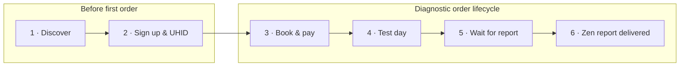
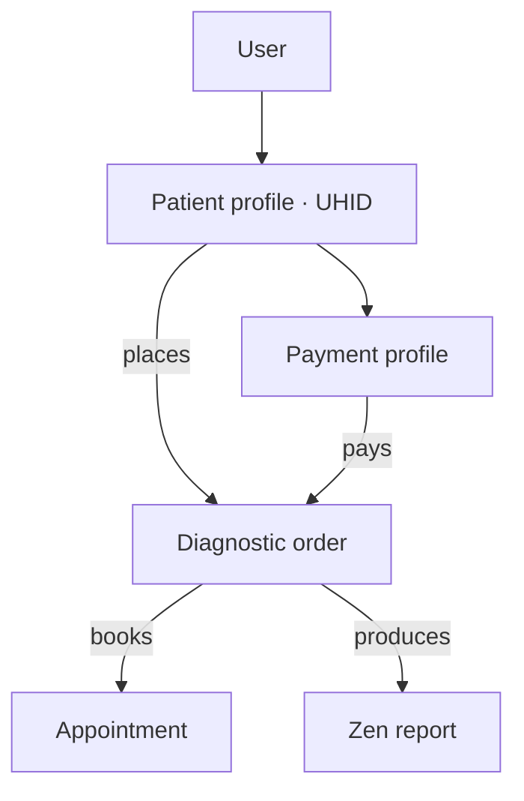
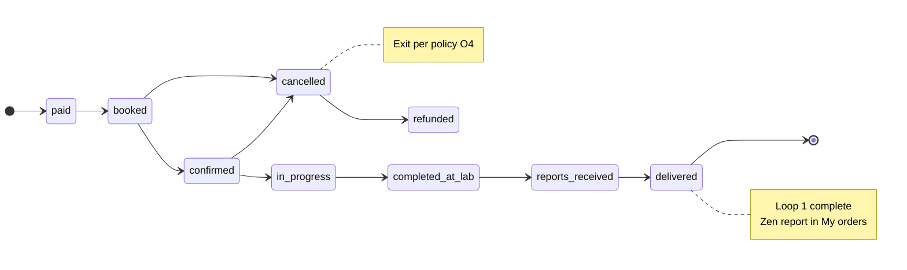
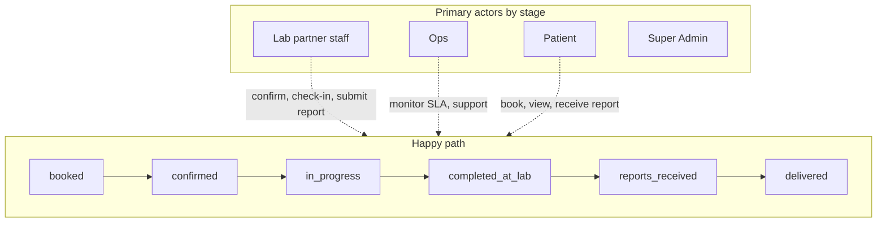
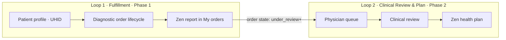

**Version:** 1.1 · **Date:** July 2026  
**Parent:** [Product Blueprint](/clients/zen/doc-1/) v1.3 · Phase 1 (non-AI)  
**Audience:** Zen Life stakeholders, product, operations, lab partners

---

## 1. Scope

| | |
|--|--|
| **Loop** | Loop 1 — Fulfillment |
| **Phase** | Phase 1 only |
| **AI** | None — ingest and store Zen report; patient views as delivered |
| **Trigger** | Patient books a diagnostic package *(requires an active patient profile)* |
| **Ends when** | Diagnostic order reaches **`delivered`** — Zen report is in Zenlife and visible to the patient *(e.g. under My orders)* |
| **Spine entities** | **Patient profile** *(identity)* → **Diagnostic order** *(commerce & fulfillment)* → **Zen report** *(clinical artefact)* |

### Locked decisions *(this doc)*

- **P8 / wait:** Phase 1 ends when the **Zen report is ready** in the patient’s order view — not when a Zen health plan is ready *(Loop 2)*.
- **Lab calendar:** **Lab partner staff** manage their own **lab schedule slots and capacity** from day one — capability exists at **lab partner level only**.
- **Granularity:** Actions described at **diagnostic order** level only. Smallest sellable unit breakdown *(package item / order line)* comes later.
- **Report intake:** **No manual Ops upload** in Phase 1. All lab partner staff use the **same portal** to submit Zen reports. Manual Ops intake and a dedicated external partner portal are **later**.
- **Rebook:** **Out of scope** for this doc.

---

## 2. End-to-end sequence *(Phase 1)*

Fulfillment is not only the order lifecycle — it starts when a person becomes a **registered patient** in Zenlife. The sequence below is the correct order of operations.

| Step | Stage | Primary actor | Outcome |
|------|-------|---------------|---------|
| **1** | **Discover** | Patient *(anonymous)* | Browses packages and how Zenlife works |
| **2** | **Sign up & profile** | Patient | **User** created (OTP) → **Patient profile** created with **UHID** |
| **3** | **Book & pay** | Patient | **Diagnostic order** + **Appointment**; payment captured |
| **4** | **Test day** | Patient + Lab partner | Check-in → tests at lab |
| **5** | **Wait** | Patient | Order progresses **`completed_at_lab` → `reports_received`** |
| **6** | **Zen report ready** | Lab partner → Patient | Order **`delivered`**; report visible in **My orders** |

Steps **1–2** happen before any order exists. Steps **3–6** follow the diagnostic order lifecycle in §4.

---

## 3. User, patient profile & UHID

Every Fulfillment journey is anchored to a **patient profile**. The profile is created at sign-up — **before** the first booking — and persists across all future orders and Zen reports.

### 3.1 Three layers — do not conflate

| Layer | What it is | Phase 1 role |
|-------|------------|--------------|
| **User** | Auth identity — mobile number, OTP login, assigned roles | Sign-in; owns the account |
| **Patient profile** | Regulated **health subject** record linked to the User — demographics, **UHID**, consent, preferences | Created at sign-up; **every diagnostic order and Zen report belongs to this profile** |
| **Patient-facing health profile** | **Graph projection** — good / concern / next steps, AI copy, chat entry points | **Not in Phase 1** *(Loop 3)* — do not build or promise this in Fulfillment |

*Internal entity names: User, Patient profile. UHID is introduced here as a Fulfillment requirement and should be added to the entity model on the next engineering pass.*

### 3.2 UHID — unique identifier

**UHID** *(Unique Health Identifier)* is the **canonical, system-assigned identifier** for a patient profile in Zenlife — analogous to identifiers used by regulated healthcare entities.

| Property | Rule |
|----------|------|
| **Assigned when** | At **patient profile creation** (sign-up), before the first diagnostic order |
| **Uniqueness** | **Globally unique** within Zenlife; never reused |
| **Immutability** | **Permanent** — does not change if the patient updates mobile, name, or address |
| **Visibility** | Shown on patient profile, diagnostic orders, appointments, and Zen reports *(lab and ops workflows)* |
| **Purpose** | Single stable key for regulated operations: lab requisitions, report matching, audit, support, and future clinical integrations |

UHID is **not** the mobile number, email, or internal database primary key exposed to users — it is the **regulated-facing patient identifier** for the Zenlife ecosystem.

### 3.3 Patient profile — Phase 1 fields *(Fulfillment minimum)*

Collected or assigned during **sign up** (Product Blueprint §3.2):

| Field / artefact | Collected by | Notes |
|------------------|--------------|-------|
| **UHID** | System | Auto-generated at profile creation |
| **Mobile number** | Patient | OTP verification; login identity on **User** |
| **Gender** | Patient | Package eligibility gates |
| **Age / date of birth** | Patient | Package eligibility gates *(exact field TBD with Zen Life)* |
| **Consent** | Patient | Terms, privacy, health-data processing *(L3)* |
| **Name** | Patient | Display and lab-facing identity *(if collected at sign-up)* |
| **Payment profile** | Patient | Created or linked when first paying *(may be deferred until book step)* |

Phase 1 does **not** require a populated knowledge graph or patient-facing health profile. The **patient profile** is the identity shell; Zen reports attach to it as files.

### 3.4 Profile × actor actions *(Phase 1)*

What each actor can do on the **patient profile** during Loop 1 *(not on a specific order)*:

| Actor | Can do | Cannot do |
|-------|--------|-----------|
| **Patient** | **Create** profile at sign-up. **View** own profile & UHID. **Edit** own demographics & consent *(policy TBD)*. **View** own order history & Zen reports under My orders. | View other patients. Edit UHID. |
| **Ops** | **View** any patient profile & UHID. **View** all orders and reports for support. **Assist** profile corrections on request *(audit logged)*. | Create profiles on behalf of patients *(unless Zen Life decides otherwise)*. |
| **Lab partner staff** | **View** patient identity fields **needed for the appointment** *(name, UHID, gender, age, package)* on **their** lab’s appointments only. | Browse all patients. Edit profile. |
| **Super Admin** | **View** all profiles & UHIDs. **Manage** user accounts & roles. **Deactivate** account *(soft)* on exception. | Impersonate patient without audit. |

### 3.5 How profile links to fulfillment artefacts

- Every **diagnostic order** is placed **by** a patient profile *(not by a bare User)*.
- Every **Zen report** is linked to the **diagnostic order** and therefore to the **patient profile / UHID**.
- Lab partner staff see **UHID on the appointment** when confirming, checking in, and submitting the report — for correct patient matching.

---

## 4. Diagnostic order lifecycle

Payment completes before the order is **`booked`**. The stage × actor matrix (§5) covers **`booked` → `delivered`** plus exception exits.

States **`under_review` and beyond** belong to **Loop 2 — Clinical Review & Plan**, not Fulfillment.

---

## 5. Stage × actor action matrix

**How to read:** each row is an order **state**. Columns list what each actor **can do on that order** at that state. The order is always tied to a **patient profile (UHID)**. Actions apply to the **diagnostic order** and its linked **appointment** / **Zen report** as noted.

| Order state | Patient | Ops | Lab partner staff | Super Admin |
|-------------|---------|-----|-------------------|-------------|
| **`booked`** *(slot reserved; payment captured)* | **View** order & appointment in My orders *(profile / UHID shown)*. **Reschedule** own appointment *(if policy allows)*. **Cancel** own order *(refund per policy O4)*. | **View** order, **UHID**, & patient record. **Reschedule** appointment. **Cancel** order. **Send** booking confirmation. **Monitor** day-of schedule. | **View** upcoming appointments *(patient name, **UHID**, package)*. **Confirm** → **`confirmed`**. **Manage** lab schedule slots & capacity *(lab-level)*. | **View** all orders. **Reschedule** or **cancel** *(exception)*. **View** catalog, partners, payout status *(not edit catalog here)*. |
| **`confirmed`** *(lab acknowledged booking)* | **View** order status & appointment. **Receive** reminders. **Reschedule** or **cancel** own order *(per policy)*. | **View** order & UHID. **Reschedule** or **cancel** on patient’s behalf. **Monitor** no-shows & SLA. | **View** appointment *(UHID for check-in)*. **Check in** patient → **`in_progress`**. | **View** order. **Reschedule** or **cancel** *(override)*. |
| **`in_progress`** *(patient at lab; tests underway)* | **View** status *(e.g. “In progress at lab”)*. Typically **cannot** reschedule or cancel *(contact support)*. | **View** order. **Monitor** SLA. **Cancel** only on exception. | **View** appointment. **Mark completed at lab** → **`completed_at_lab`**. | **View** order. **Override** state or **cancel** on exception. |
| **`completed_at_lab`** *(tests done; report not yet submitted)* | **View** status *(“Processing — awaiting report”)*. **Wait** — no Zen report yet. | **View** order & UHID. **Monitor** 24–48h report SLA *(O2)*. **Chase** overdue reports with lab. | **View** order *(match report to **UHID**)*. **Submit Zen report** via lab portal → **`reports_received`**. | **View** order & SLA dashboard. **Intervene** on stuck orders. |
| **`reports_received`** *(Zen report submitted; system processing)* | **View** status *(“Report received — preparing”)*. Cannot open final report yet. | **View** order & intake status. **Monitor** processing. **Notify** when ready. | **View** submitted report *(UHID on record)*. **Update / re-submit** if correction needed. | **View** order. **Exceptional archive / remove** Zen report *(audit retained)*. |
| **`delivered`** *(Zen report ready — Fulfillment complete)* | **View** Zen report in **My orders** *(PDF / viewer)*. Order **complete**. *(No Zen health plan in Phase 1.)* | **View** order, report, UHID. **Support** access issues. | **View** submitted report *(read-only)*. | **View** order, report, payout. **Archive** on exception. Payout typically automatic. |

### Exception states *(same actors; summary)*

| Order state | Patient | Ops | Lab partner staff | Super Admin |
|-------------|---------|-----|-------------------|-------------|
| **`cancelled`** | **View** cancelled order & refund status | **Cancel** + notify patient | **View** only | **Cancel** / override; audit |
| **`refunded`** | **View** refund confirmation | **View** reconciliation | — | **View** payment & payout records |

---

## 6. What each actor does *not* do in Phase 1 Fulfillment

| Actor | Out of scope |
|-------|----------------|
| **Patient** | Create or upload Zen reports. View AI interpretation, patient-facing health profile, or Zen health plan *(Loop 2+)*. Rebook *(deferred)*. |
| **Ops** | **Manual Zen report upload** *(deferred)*. Create/edit packages or commercial terms *(Super Admin only)*. |
| **Lab partner staff** | Edit catalog, pricing, or patient profile fields. Manage slots for other lab partners. |
| **Super Admin** | Day-to-day appointment operations *(Ops)*. Submit Zen reports *(lab portal)*. |
| **Physician** | Not in Loop 1. |
| **Clinician QA** | Not in Loop 1. |

---

## 7. Notifications *(by stage — illustrative)*

| Transition | Typical notification |
|------------|---------------------|
| Profile created | Welcome / UHID confirmation *(optional)* |
| → **`booked`** | Booking confirmed *(patient)* |
| → **`confirmed`** | Appointment confirmed *(patient)* |
| → **`in_progress`** | Optional: checked in *(patient)* |
| → **`delivered`** | Zen report ready — view in My orders *(patient)* |
| SLA breach on **`completed_at_lab`** | Internal chase *(Ops ↔ lab)* |

---

## 8. Handoff to Loop 2

When the order is **`delivered`**, Fulfillment is **complete**. The Zen report exists in the system, linked to the **patient profile (UHID)**. **Loop 2** *(Phase 2)* begins when the physician queue picks up the report for clinical review and Zen health plan drafting — states **`under_review` and beyond**.

---

## 9. Related Zen Life decisions

| ID | Question | Blocks |
|----|----------|--------|
| **L3** | Brand, copy, **consent language** | Sign-up & profile |
| **New** | **UHID format & assignment rules** *(prefix, length, checksum)* | Profile creation, lab matching |
| B1, B2 | Launch packages & pricing | Booking |
| O1 | Lab Zen report delivery format | Lab submit → **`reports_received`** |
| O2 | 24–48h turnaround commitment | SLA on **`completed_at_lab`** |
| O3 | Payment methods | **`paid` → `booked`** |
| O4 | Refund & cancellation policy | Patient/Ops cancel actions |
| O5 | Ops team size & hours | Ops coverage |

---

## 10. Related documents

| Document | Role |
|----------|------|
| [Product Blueprint](/clients/zen/doc-1/) | Parent blueprint — loops, phases, permissions |

---

*Fulfillment loop v1.1 — patient profile & UHID added; derived from Product Blueprint v1.3 Phase 1 scope.*
